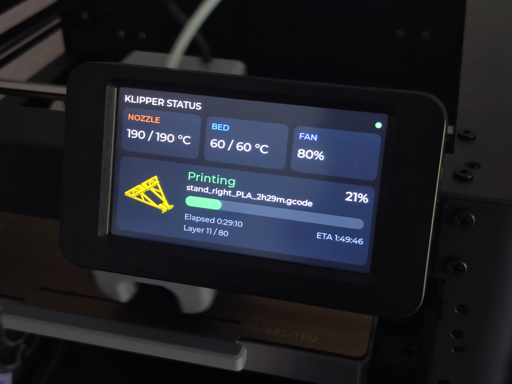

# klipper-status



A minimal LVGL status screen for Klipper, rendered directly to a Linux
framebuffer (`/dev/fb0`) and fed by the Moonraker API. Built for a 800x480
panel but resolution-agnostic (the fbdev driver reads geometry from the device).

Shows: nozzle + bed temperature (current/target), cooling fan speed, 
print state, current filename, progress bar, elapsed print time and a job thumbnail.

## AI use disclosure

This project was built with reasonable support from Anthropics Claude LLM.
Mainly because I am by no means an embedded software or C/C++ developer and my experience with LVGL is very limited.

This project was mainly started as a gimmicky thing on the side, 
since I wanted to see if I could get the display on my Flashforge AD5M 3D printer 
to show something useful after having installed Klipper on it.

## Build Dependencies

Debian/Ubuntu:
```
sudo apt install build-essential cmake git libcurl4-openssl-dev libcjson-dev
```
Arch:
```
sudo pacman -S base-devel cmake git curl cjson
```

## Build

```
./build.sh
```
This clones LVGL v9.2 into `./lvgl` and produces `./build/klipper_status`.

## Run

```
sudo ./build/klipper_status
```
Root (or membership in the `video` group) is needed for framebuffer access.

### Configuration (environment variables)

| Variable                | Default       | Purpose                          |
|-------------------------|---------------|----------------------------------|
| `MOONRAKER_HOST`        | `127.0.0.1`   | Moonraker host                   |
| `MOONRAKER_PORT`        | `7125`        | Moonraker port                   |
| `MOONRAKER_POLL_MS`     | `1000`        | Poll interval (ms)               |
| `LV_LINUX_FBDEV_DEVICE` | `/dev/fb0`    | Framebuffer device node          |

Example:
```
sudo MOONRAKER_HOST=192.168.1.50 ./build/klipper_status
```

## Notes

- Hide the console cursor on a Pi: add `vt.global_cursor_default=0` to
  `/boot/cmdline.txt`.
- If the screen stays black/partial, set
  `LV_LINUX_FBDEV_RENDER_MODE` to `LV_DISPLAY_RENDER_MODE_DIRECT` in `lv_conf.h`.
- To run on boot, wrap the binary in a systemd service.

## Files

| File           | Role                                            |
|----------------|-------------------------------------------------|
| `main.c`       | LVGL init, framebuffer display, tick, main loop |
| `ui.c` / `.h`  | Screen layout + 2 Hz refresh timer              |
| `moonraker.c`  | Background poll thread (libcurl + cJSON)        |
| `lv_conf.h`    | LVGL build config (fbdev + fonts enabled)       |

## Third-party components

- [LVGL](https://github.com/lvgl/lvgl) - Light and Versatile Graphics Library  
Embedded graphics library to create beautiful UIs for any MCU, MPU and display type.

- [cJSON](https://github.com/DaveGamble/cJSON) by Dave Gamble  
Ultralightweight JSON parser in ANSI C

- [lodepng](https://github.com/lvandeve/lodepng) by Lode Vandevenne  
PNG encoder and decoder in C and C++
